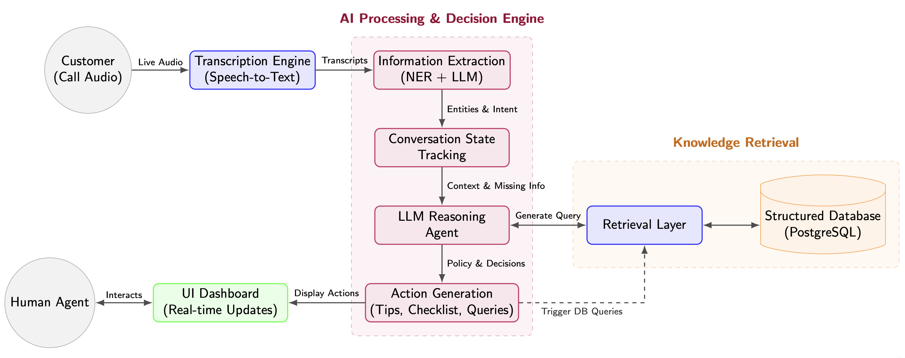

# AI Sales Copilot (Real-Time Agent System for Call Centers)

## Overview

Real-time AI copilot designed to assist call center agents during hotel reservation calls.



The system combines:
- Live speech-to-text transcription
- LLM-based information extraction and reasoning
- Context-aware conversation guidance
- Structured decision support (checklists, next actions)
- Database retrieval for pricing, availability, and packages

It is built as an agent-like system that augments human decision-making, not replaces it.

---

## Key Contributions

- Real-time AI agent supporting human operators in live conversations
- Structured extraction of customer state from noisy speech input
- Context-aware suggestion engine (next questions, upsell strategies)
- Human-in-the-loop decision system with dynamic checklist tracking
- Retrieval-augmented responses from structured company databases
- End-to-end pipeline: speech → reasoning → action → interface

---

## System Architecture

Pipeline:

Call Audio
→ Speech-to-Text (real-time transcription)
→ Information Extraction (NER + LLM)
→ Conversation State Tracking
→ LLM Reasoning Layer
→ Action Generation (tips, checklist updates, queries)
→ Database Retrieval (pricing, availability, packages)
→ UI Dashboard (real-time updates)

Core modules:
- Transcription Engine (STT)
- State Tracker (structured customer profile)
- Reasoning Agent (LLM-based decision layer)
- Retrieval Layer (database + business logic)
- UI Interface (agent dashboard)

---

## Core Capabilities

### Real-Time Information Extraction
- Identifies key entities from live conversation:
  - Customer profile
  - Travel intent
  - Dates, budget, preferences
- Continuously updates structured state

### Conversation Guidance Engine
- Generates context-aware next questions
- Detects:
  - upsell opportunities
  - objections
  - closing signals
- Adapts to conversation stage dynamically

### Decision Support System
- Tracks required reservation fields
- Highlights missing information
- Prioritizes actions that unblock conversion

### Retrieval-Augmented Responses
- Queries structured database:
  - room availability
  - pricing
  - packages
  - amenities
- Returns formatted, actionable results

---

## Tech Stack

Frontend:
- React / Next.js
- WebSockets (real-time updates)
- Tailwind CSS

Backend:
- Node.js / Express or Python (hybrid architecture)
- WebSocket server for streaming data

AI Components:
- Speech-to-Text (Whisper / Deepgram / AssemblyAI)
- LLM (GPT-4 / Claude)
- LangChain / orchestration layer
- NER + intent detection pipeline

Database:
- PostgreSQL (structured hotel data)

---

## Agent Design

The system behaves as a structured AI agent with:

- State representation:
  - customer profile
  - conversation stage
  - missing fields
- Policy layer:
  - what to ask next
  - when to upsell
  - when to close
- Action space:
  - generate questions
  - trigger database queries
  - update checklist
- Observation stream:
  - real-time transcription input

This aligns with:
- conversational agents
- decision support systems
- human-AI collaboration loops

---

## Project Structure

```
frontend/
  components/        # UI modules (customer panel, tips, checklist)
  hooks/             # WebSocket + AI integration
  pages/             # Agent dashboard

backend/
  api/               # transcription, AI processing, DB queries
  services/          # extraction, conversation analysis, booking logic
  models/            # data models

database/
  schema.sql
  seed_data.sql

config/
  system_prompt.txt
  mcp_config.json
```

---

## Installation

```bash
git clone https://github.com/Vania-Janet/AI-Agent-Call-Center-Assistant.git
cd summit2025
```

Frontend:

```bash
cd frontend
npm install
```

Backend:

```bash
cd backend
npm install
```

Python (AI services):

```bash
python3 -m venv venv
source venv/bin/activate
pip install -r requirements.txt
```

Configure environment:

```bash
cp .env.example .env
```

Required:
- OPENAI_API_KEY
- STT provider API key
- DATABASE_URL

---

## Running the System

Development:

```bash
# Backend
cd backend
npm run dev

# Frontend
cd frontend
npm run dev

# AI service
cd backend
source ../venv/bin/activate
python ai_service.py
```

---

## Example Workflow

Input (live call):

"Hi, we’re celebrating our anniversary and looking for a room next month."

System output:

- Extracts:
  - 2 adults
  - anniversary → romantic intent

- Suggests:
  - ask for dates
  - offer romance package

- Updates checklist:
  - missing: contact info, dates

- Queries DB:
  - available rooms for given dates

- Displays:
  - pricing + packages + recommendations

---

## Evaluation Metrics

- Conversion Rate Improvement
- Average Handling Time Reduction
- Information Completeness (% fields captured)
- Response Latency (<2s target)
- Upsell Conversion Rate
- First-Call Resolution

---

## Production Considerations

- Real-time latency constraints
- streaming reliability (WebSockets)
- model inference cost
- database query optimization
- observability (logs, traces)
- privacy and compliance (PII handling)

---

## Positioning

This project is not just a chatbot.

It is a real-time decision support agent with:
- continuous state tracking
- structured reasoning over conversations
- retrieval-augmented actions
- human-in-the-loop alignment

Relevant for:
- AI Agents / LLM Systems
- Applied NLP in production
- Real-time decision systems
- Conversational intelligence platforms

---
